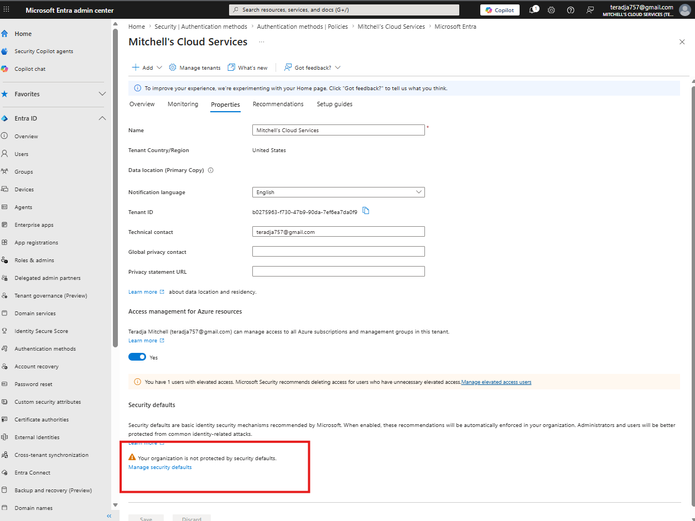
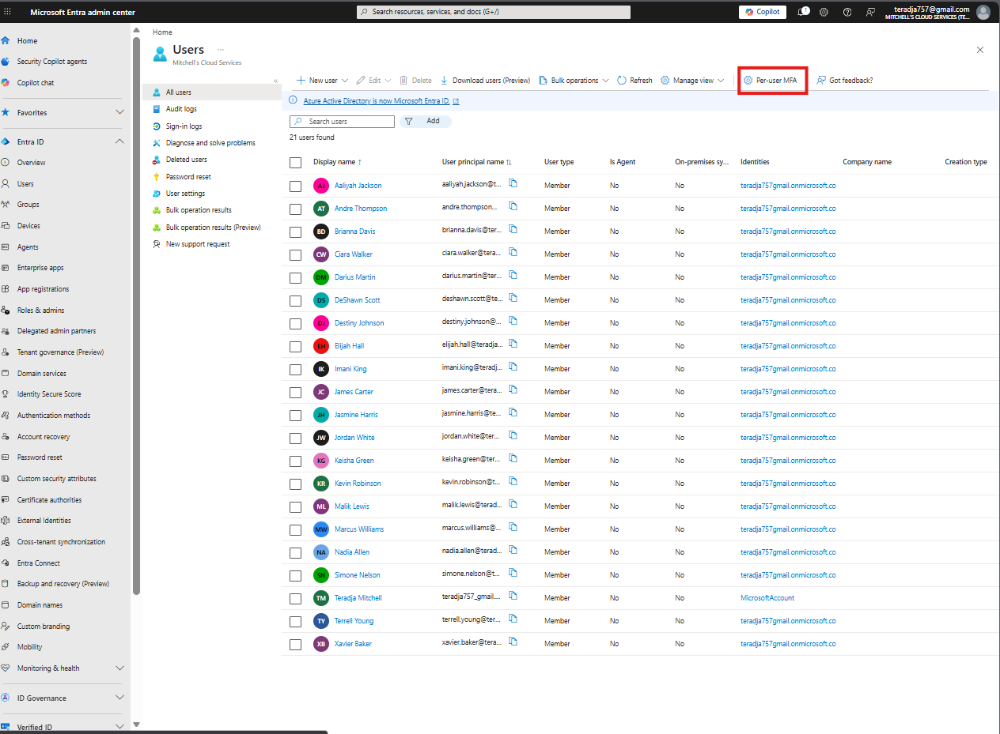
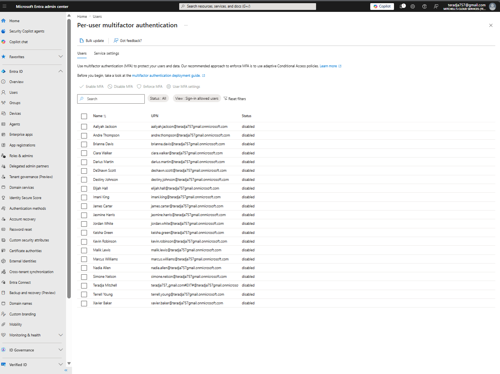
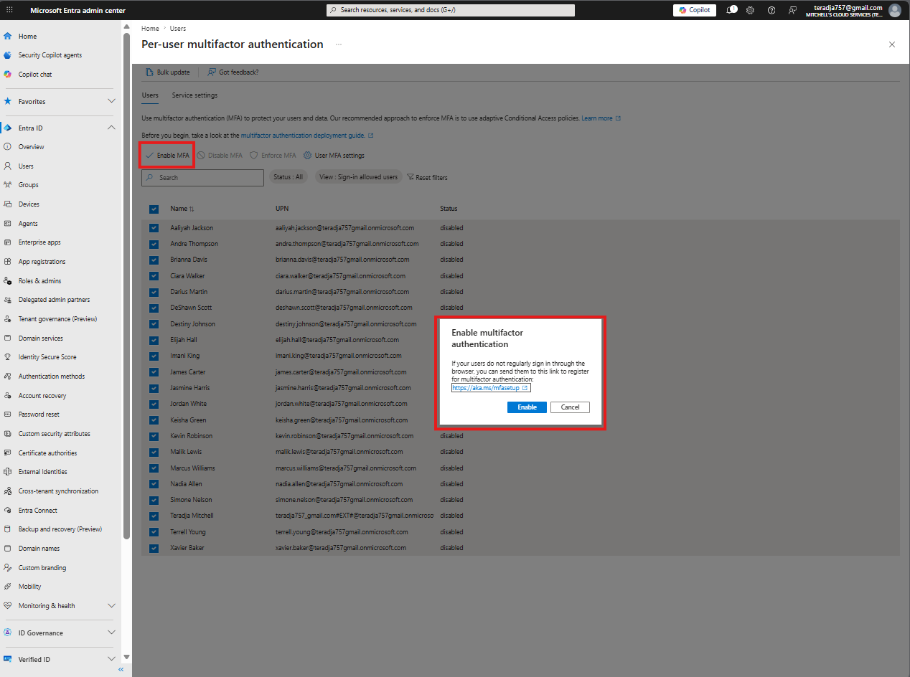
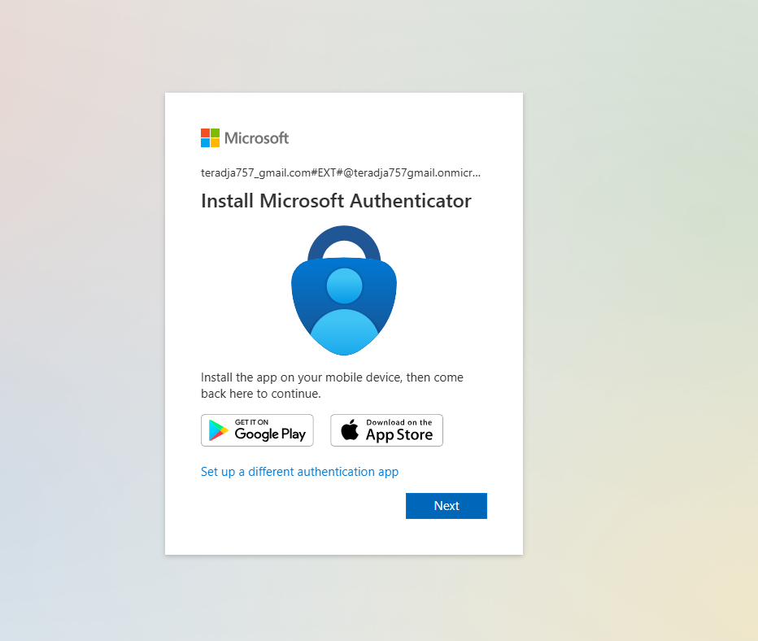
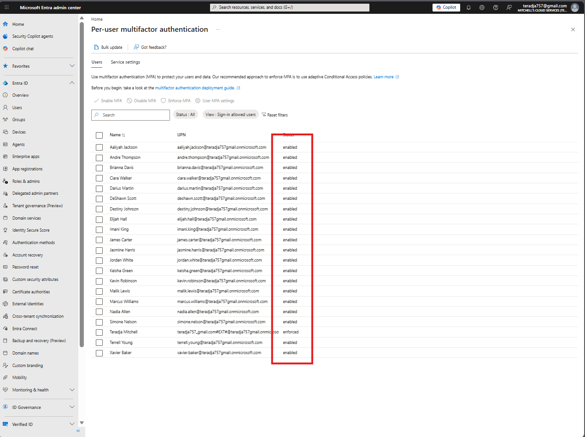

# Lab 01 — Enforcing MFA for All Users via Per-User Multifactor Authentication

**Platform:** Microsoft Entra ID  
**Tenant:** Mitchell's Cloud Services  
**License:** Microsoft Entra ID Free

## What This Lab Covers

Enabled MFA across all users in a Microsoft Entra ID tenant using per-user MFA. Started with Security Defaults disabled and no MFA enforcement in place. By the end every user had MFA enabled and the admin account was fully enforced after completing registration.

## Why This Matters

MFA is one of the highest-impact controls you can implement. Microsoft's data shows it blocks over 99% of account-based attacks. In healthcare and other regulated environments it is a baseline requirement — HIPAA, SOC 2, and HITRUST all expect it.

## Environment

- **Tenant:** Mitchell's Cloud Services
- **Admin account:** Teradja Mitchell
- **Users provisioned:** 20 test accounts
- **Starting state:** Security Defaults disabled, no MFA configured

## MFA Options on Entra ID Free Tier

| Method | License | Notes |
|--------|---------|-------|
| Security Defaults | Free | All-or-nothing, no customization |
| Per-user MFA | Free | Configured per account |
| Conditional Access | P1/P2 | Policy-based, most flexible |

Per-user MFA is a valid compensating control when Conditional Access licensing is not available. Accepted under HIPAA and SOC 2 audits.

## Step 1 — Confirm Starting State

Verified Security Defaults was off before making any changes. With it disabled, users can authenticate with just a password — no MFA required.

*Tenant Properties — Security Defaults disabled.*

## Step 2 — Navigate to Users

1. Signed into [entra.microsoft.com](https://entra.microsoft.com)
2. Clicked **Users** in the left nav
3. Confirmed all 20 accounts were in the directory
4. Clicked **Per-user MFA** in the toolbar

*Users list with Per-user MFA button highlighted.*

## Step 3 — Confirm Baseline MFA State

Every user showed **disabled**. No MFA configured on any account.

*All 20 users at disabled status before any changes.*

## Step 4 — Select All Users and Enable MFA

1. Checked the box next to **Name** to select all 20 users
2. Clicked **Enable MFA** in the toolbar
3. Confirmed the dialog

*All 20 users selected with the Enable MFA confirmation dialog.*

## Step 5 — MFA Enforcement Triggered

Immediately after enabling, the admin account was prompted to register Microsoft Authenticator. Policy took effect in real time.

In production you would register admin accounts for MFA before enabling it tenant-wide.

*Authenticator registration prompt on the admin account right after the policy applied.*

## Step 6 — Verify Results

After registration the panel updated:

- 19 standard users: **enabled**
- Admin account: **enforced**

| Status | Meaning |
|--------|---------|
| Disabled | MFA not required |
| Enabled | MFA required, user has not registered yet |
| Enforced | MFA required, registration complete |

Standard users will be prompted to register on next sign-in.

*All users enabled. Admin account enforced.*

## Compliance Mapping

| Framework | Control | Notes |
|-----------|---------|-------|
| HIPAA | 45 CFR 164.312(d) | Authentication controls for systems handling ePHI |
| SOC 2 | CC6.1 | Logical access control requirement |
| HITRUST CSF | 01.d | User authentication enforcement |
| NIST 800-63B | AAL2 | Second factor authentication requirement |

## What I Would Do Differently in Production

- Use Conditional Access instead of per-user MFA
- Register admin accounts before enabling tenant-wide
- Exclude break-glass accounts from blanket MFA policies
- Prefer Microsoft Authenticator over SMS
- Review sign-in logs after enabling to catch failures early

## References

- [Microsoft Docs — Per-user MFA](https://learn.microsoft.com/en-us/entra/identity/authentication/howto-mfa-userstates)
- [Microsoft Docs — MFA deployment guide](https://aka.ms/mfasetup)
- [NIST SP 800-63B](https://pages.nist.gov/800-63-3/sp800-63b.html)

*Teradja Mitchell | [LinkedIn](https://www.linkedin.com/in/teradja-mitchell-0494b9208) | [GitHub](https://github.com/teradja757)*
