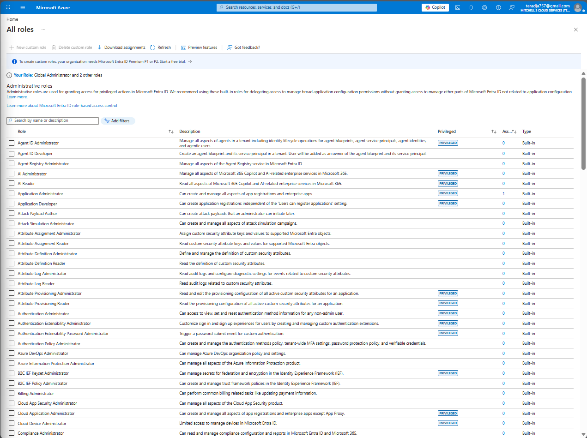
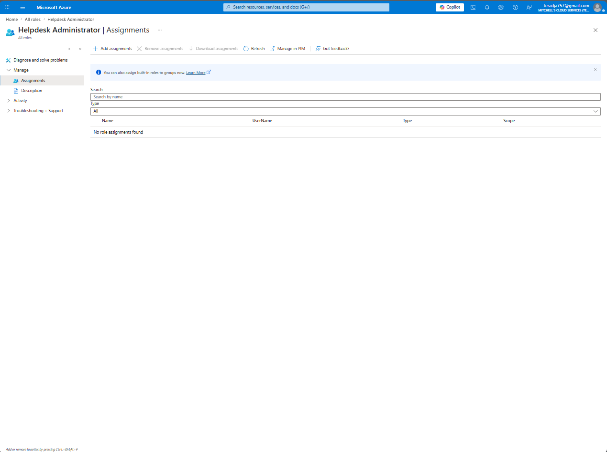
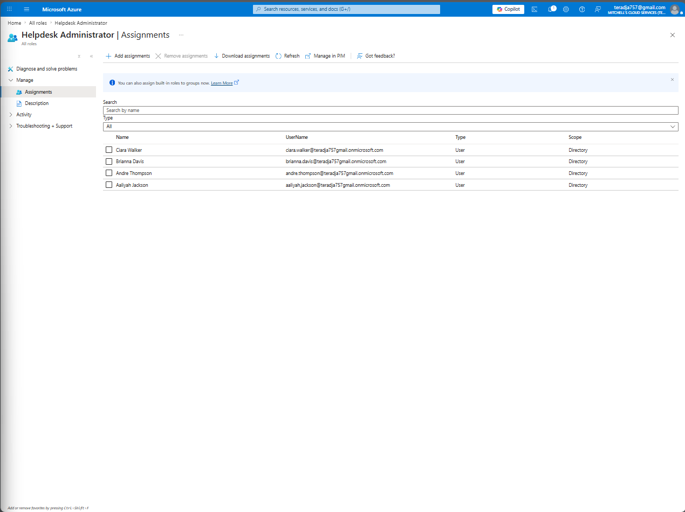
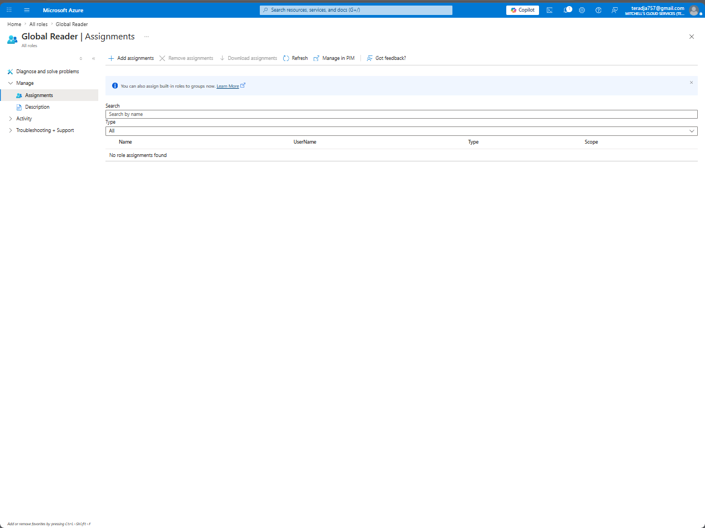
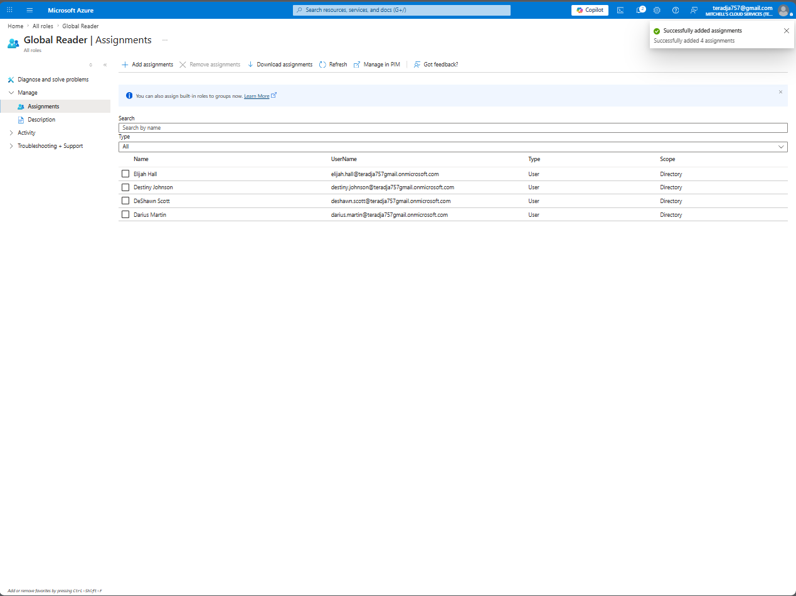
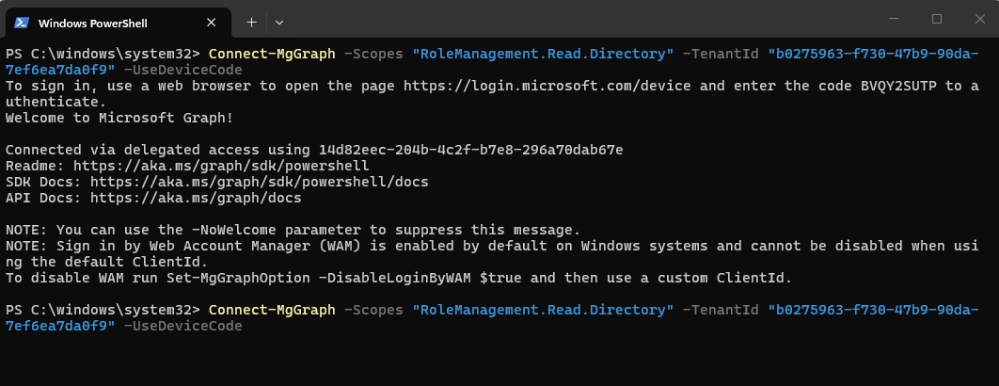
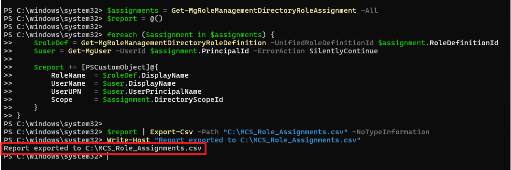
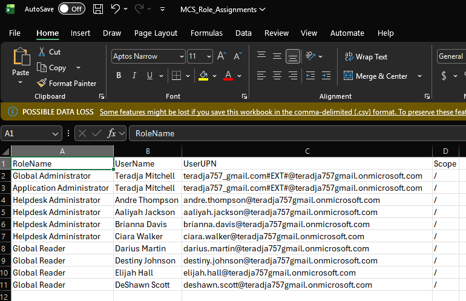
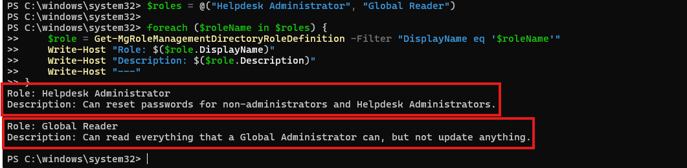

# Lab 03 — Entra ID Role Assignment and Privileged Access Management

**Platform:** Microsoft Entra ID
**Tenant:** Mitchell's Cloud Services
**License:** Microsoft Entra ID Free

## What This Lab Covers

Assigned Entra ID built-in roles to users directly in the portal and verified the assignments using Microsoft Graph PowerShell. The lab covers two roles aligned to the RBAC groups built in Lab 02 — Helpdesk Administrator and Global Reader. The PowerShell portion covers querying all active role assignments and exporting a full role assignment report for audit use. A written section covers how this same configuration would be implemented using Privileged Identity Management (PIM) in a licensed environment, including eligible assignments, JIT activation, approval workflows, and Zero Trust alignment.

## Why Role Assignment Matters

Direct user permission assignment doesn't scale and doesn't audit well. In any environment with more than a handful of users, you need a structured approach — roles assigned to defined principals, scoped appropriately, with a clear record of who has what and why. This is the foundation of least privilege access control and a core requirement under HIPAA, SOC 2, HITRUST, and NIST 800-53.

In a P1 licensed environment, these roles would be assigned to the security groups built in Lab 02 rather than individual users. In a P2 licensed environment, those assignments would be eligible rather than active — meaning users only hold the role when they explicitly request and activate it through PIM. This lab demonstrates the assignment logic on free tier and documents the production architecture in the PIM section below.

## Environment

- **Tenant:** Mitchell's Cloud Services
- **Admin account:** Teradja Mitchell
- **Users provisioned:** 21 accounts
- **Starting state:** No role assignments configured

## Roles Assigned

| Role | Assigned Users | What It Can Do |
|------|---------------|----------------|
| Helpdesk Administrator | Ciara Walker, Brianna Davis, Andre Thompson, Aaliyah Jackson | Reset passwords for non-administrators and Helpdesk Administrators |
| Global Reader | Elijah Hall, Destiny Johnson, DeShawn Scott, Darius Martin | Read everything a Global Administrator can, but cannot update anything |

## Part 1 — Portal

### Step 1 — Confirm Baseline

Navigated to Microsoft Entra ID > Roles and administrators to confirm the starting state. The full list of built-in administrative roles was visible with zero assignments on the target roles.


*All roles listed with no active assignments on Helpdesk Administrator or Global Reader.*

### Step 2 — Assign Helpdesk Administrator

Selected Helpdesk Administrator from the roles list. Confirmed no assignments existed before proceeding.


*Helpdesk Administrator role with no assignments — clean starting state.*

Clicked Add assignments and selected the four users mapped to the SG-RBAC-HelpDesk group from Lab 02. In a P1 licensed environment, this would be a single group assignment to SG-RBAC-HelpDesk rather than four individual user assignments. Group-based role assignment is more scalable, easier to audit, and eliminates the risk of access drift from one-off individual assignments.


*Ciara Walker, Brianna Davis, Andre Thompson, and Aaliyah Jackson assigned to Helpdesk Administrator.*

### Step 3 — Assign Global Reader

Selected Global Reader from the roles list. Confirmed no assignments existed before proceeding.


*Global Reader role with no assignments — clean starting state.*

Clicked Add assignments and selected the four users mapped to the SG-RBAC-Compliance group from Lab 02. Same note applies — in a P1 environment this would be a single assignment to SG-RBAC-Compliance.


*Elijah Hall, Destiny Johnson, DeShawn Scott, and Darius Martin assigned to Global Reader.*

## Part 2 — PowerShell

Connected to Microsoft Graph with the scope required for reading role management data:

```powershell
Connect-MgGraph -Scopes "RoleManagement.Read.Directory" `
    -TenantId "b0275963-f730-47b9-90da-7ef6ea7da0f9" -UseDeviceCode
```


*Connected to Microsoft Graph via device code authentication.*

### Export All Role Assignments

Pulled every active role assignment in the tenant, resolved each to a human-readable role name and user display name, and exported to CSV. This is the kind of report you produce during a SOC 2 Type II audit to prove who holds privileged access and what they can do with it.

```powershell
$assignments = Get-MgRoleManagementDirectoryRoleAssignment -All
$report = @()

foreach ($assignment in $assignments) {
    $roleDef = Get-MgRoleManagementDirectoryRoleDefinition -UnifiedRoleDefinitionId $assignment.RoleDefinitionId
    $user = Get-MgUser -UserId $assignment.PrincipalId -ErrorAction SilentlyContinue

    $report += [PSCustomObject]@{
        RoleName  = $roleDef.DisplayName
        UserName  = $user.DisplayName
        UserUPN   = $user.UserPrincipalName
        Scope     = $assignment.DirectoryScopeId
    }
}

$report | Export-Csv -Path "C:\MCS_Role_Assignments.csv" -NoTypeInformation
Write-Host "Report exported to C:\MCS_Role_Assignments.csv"
```


*All role assignments queried and exported to C:\MCS_Role_Assignments.csv.*


*Full role assignment report — every role, every principal, every UPN.*

### Query Role Descriptions

Pulled the official Microsoft description for each assigned role directly from the directory to document exactly what each role is authorized to do.

```powershell
$roles = @("Helpdesk Administrator", "Global Reader")

foreach ($roleName in $roles) {
    $role = Get-MgRoleManagementDirectoryRoleDefinition -Filter "DisplayName eq '$roleName'"
    Write-Host "Role: $($role.DisplayName)"
    Write-Host "Description: $($role.Description)"
    Write-Host "---"
}
```


*Role descriptions pulled directly from Entra ID — Helpdesk Administrator and Global Reader.*

**Helpdesk Administrator:** Can reset passwords for non-administrators and Helpdesk Administrators.

**Global Reader:** Can read everything that a Global Administrator can, but not update anything.

## Part 3 — PIM Architecture (Production Design)

This section documents how the role assignments in this lab would be configured using Microsoft Entra Privileged Identity Management in a P2 licensed environment. PIM is not available on the free tier used in this lab, but understanding and designing for it is a core requirement for any IAM or cloud security engineering role.

### Why Permanent Assignment Is a Security Risk

The assignments made in Part 1 are permanent and active. The moment a user is added, they hold the role continuously — 24 hours a day, 7 days a week, whether they need it or not. This violates the principle of least privilege and creates unnecessary attack surface.

If any of those accounts are compromised, the attacker immediately has Helpdesk Administrator or Global Reader access with no additional steps required. There is no time limit, no approval required, no justification logged. The access just exists.

This is exactly the problem PIM is designed to solve.

### Eligible vs Active Assignments

PIM introduces two assignment states:

**Active** — The user holds the role right now. Access is immediate and continuous. This is what was configured in Part 1 and what most free-tier environments are limited to.

**Eligible** — The user does not hold the role. They are authorized to request it. When they need access, they activate the assignment through PIM, provide a justification, and hold the role for a defined time window — typically 1 to 8 hours. When the window expires, the role is automatically revoked. They have to activate it again next time.

In production, both the Helpdesk Administrator and Global Reader assignments in this lab would be configured as eligible rather than active.

### JIT Activation Flow

When a user with an eligible assignment needs to use their role, the activation flow works like this:

1. User opens the PIM portal or My Access and requests activation
2. User provides a business justification for why they need the role
3. If an approval workflow is configured, a Privileged Role Administrator or designated approver receives the request and approves or denies it
4. Once approved, the role activates for the configured time window
5. All activation events are logged — who requested it, what justification they provided, who approved it, when it activated, and when it expired
6. When the window closes, the role is automatically removed with no manual action required

### PIM Configuration for This Lab

If this tenant were running Entra ID P2, the Helpdesk Administrator and Global Reader assignments would be configured as follows:

**Helpdesk Administrator — PIM Settings**
- Assignment type: Eligible
- Maximum activation duration: 4 hours
- Require justification on activation: Yes
- Require approval: Optional — appropriate for a support role with moderate privilege
- Require MFA on activation: Yes
- Assignment expiration: 90 days, reviewed quarterly

**Global Reader — PIM Settings**
- Assignment type: Eligible
- Maximum activation duration: 2 hours
- Require justification on activation: Yes
- Require approval: Yes — read access across the entire tenant warrants approval
- Require MFA on activation: Yes
- Assignment expiration: 90 days, reviewed quarterly

### Zero Trust Alignment

PIM is a direct implementation of Zero Trust principles applied to privileged identity:

**Verify explicitly** — Every activation requires MFA and a documented justification. The user has to prove who they are and why they need access every single time, not just when they first get the role.

**Use least privilege** — Users hold no standing privilege. Access only exists during the activation window for the specific task at hand. Standing access is the enemy of least privilege.

**Assume breach** — If an account is compromised, the attacker gains nothing from the role assignment because the role isn't active. They would need to go through the activation flow, which requires MFA and generates alerts that a security team can act on in real time.

In a HIPAA or SOC 2 environment, this matters significantly. The audit log produced by PIM — who activated what role, when, why, and for how long — is exactly the kind of privileged access documentation that auditors look for during a control review.

## Compliance Mapping

| Framework | Control | How This Addresses It |
|-----------|---------|----------------------|
| HIPAA | 45 CFR 164.312(a)(1) | Role-based access control with defined privilege boundaries per role |
| SOC 2 | CC6.1, CC6.3 | Logical access controls and privileged access management |
| HITRUST CSF | 01.a, 01.b, 07.a | Formal access control with defined roles and least privilege enforcement |
| NIST 800-53 | AC-2, AC-3, AC-6 | Account management, access enforcement, and least privilege |

## What I Would Do Differently in Production

- Upgrade to Entra ID P1 to assign roles to the SG-RBAC-HelpDesk and SG-RBAC-Compliance groups rather than individual users
- Upgrade to Entra ID P2 to configure all role assignments as eligible through PIM with JIT activation
- Set activation windows appropriate to each role's risk level — shorter for higher privilege
- Require approval workflows for any role with read access to sensitive data
- Schedule quarterly access reviews on all privileged role assignments
- Configure PIM alerts for unusual activation patterns — activations outside business hours, high frequency activations, or activations from unfamiliar locations

## References

- [Microsoft Docs — Entra ID Built-in Roles](https://learn.microsoft.com/en-us/entra/identity/role-based-access-control/permissions-reference)
- [Microsoft Docs — What is Privileged Identity Management](https://learn.microsoft.com/en-us/entra/id-governance/privileged-identity-management/pim-configure)
- [Microsoft Docs — Assign Entra ID Roles in PIM](https://learn.microsoft.com/en-us/entra/id-governance/privileged-identity-management/pim-how-to-add-role-to-user)
- [Microsoft Graph PowerShell — Get-MgRoleManagementDirectoryRoleAssignment](https://learn.microsoft.com/en-us/powershell/module/microsoft.graph.identity.governance/get-mgrolemanagementdirectoryroleassignment)

*Teradja Mitchell | [LinkedIn](https://www.linkedin.com/in/teradja-mitchell-0494b9208) | [GitHub](https://github.com/teradja757)*
