# Lab 04 App Registrations & Role-Based Access Control

**Platform:** Microsoft Entra ID
**Tenant:** Mitchell's Cloud Services
**License:** Microsoft Entra ID Free

## What This Lab Covers

Registered a custom application in Microsoft Entra ID, configured delegated API permissions against Microsoft Graph and Power BI Service, and defined two custom App Roles to control what users can do inside the application. Users from the PowerBI groups built in Lab 02 were assigned to those roles through the Enterprise Application blade. All assignments were validated using PowerShell and the Microsoft Graph SDK and exported to CSV.

## Why App Registrations Matter

When an application needs to interact with Microsoft APIs or enforce its own access control, it needs an identity inside Entra ID. That identity is the App Registration. It tells the directory what the app is, what it's allowed to call, and what roles it exposes to users. Without it, there's no way to control who gets access to what inside the application or audit that access after the fact.

App Roles extend that model by letting you define authorization tiers directly on the application. Instead of managing permissions per user, you define what Admins can do and what Users can do, assign people to the appropriate role, and let the application enforce the rest through token claims. This is the pattern used in real enterprise app deployments.

## Environment

- **Tenant:** Mitchell's Cloud Services
- **Admin account:** Teradja Mitchell
- **Users provisioned:** 21 accounts
- **Starting state:** No app registrations configured

## Roles Configured

| Role | Assigned Users | What It Can Do |
|------|---------------|----------------|
| PowerBI Admins | DeShawn Scott, Imani King, Teradja Mitchell | Full publish and manage rights |
| PowerBI Users | Andre Thompson, Brianna Davis, James Carter, Marcus Williams, Nadia Allen, Simone Nelson | View and interact with reports only |

## Part 1 Portal

### Step 1 Confirm Baseline

Navigated to Entra ID > App registrations and confirmed no owned applications existed before starting.

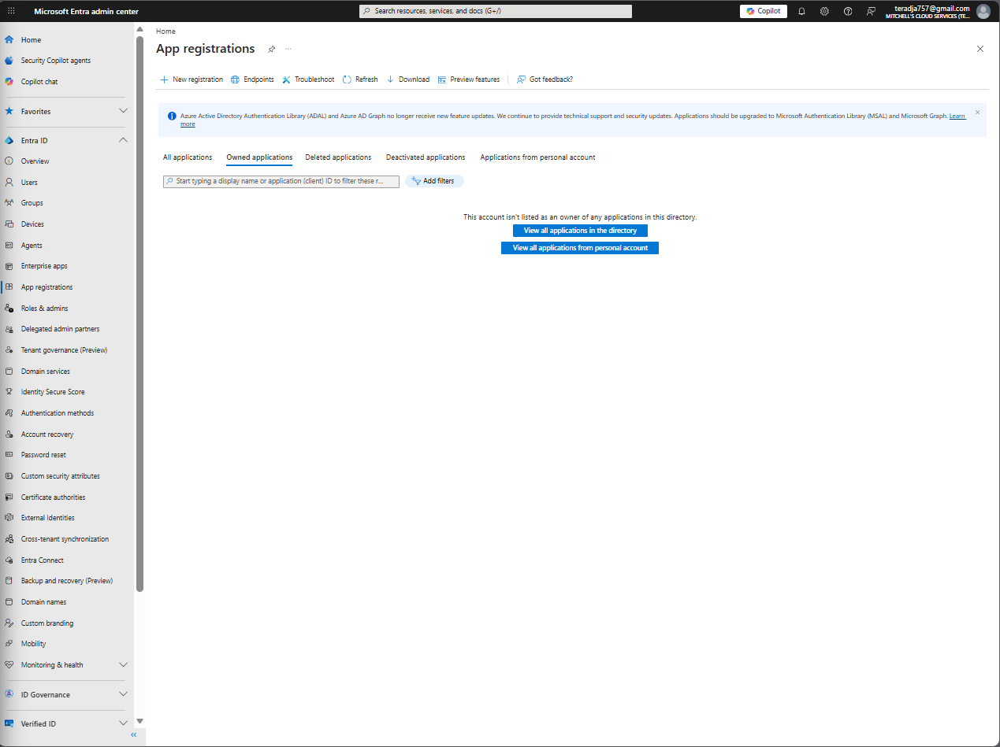
*App registrations blade on the Owned applications tab empty state.*

### Step 2 Register the PowerBI Application

Clicked + New registration. Before getting into the steps it's worth understanding what actually happens here. Registering an app creates two separate objects in Entra ID. The first is the Application object the blueprint that holds the app's identity, its declared permissions, and any App Role definitions. The second is the Service Principal the live instance of that app running inside your tenant, and the object where user assignments actually happen. These look similar in the portal but they serve different purposes and people mix them up constantly.

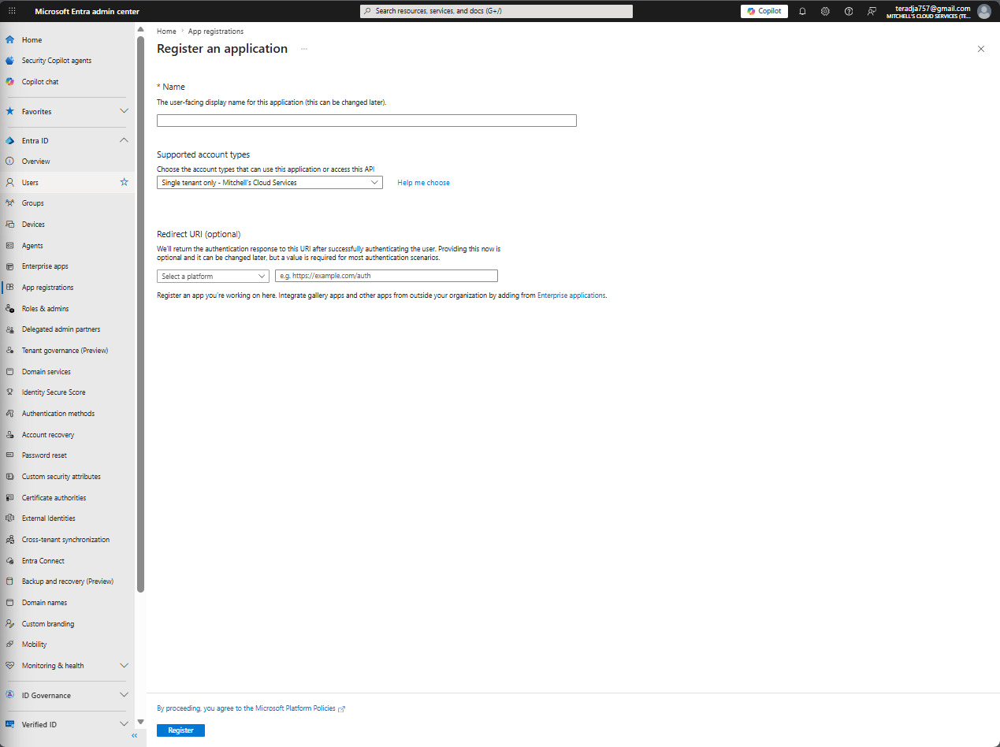
*Name set to PowerBI, account type set to single tenant (My organization only), Redirect URI left blank.*

Clicked Register.

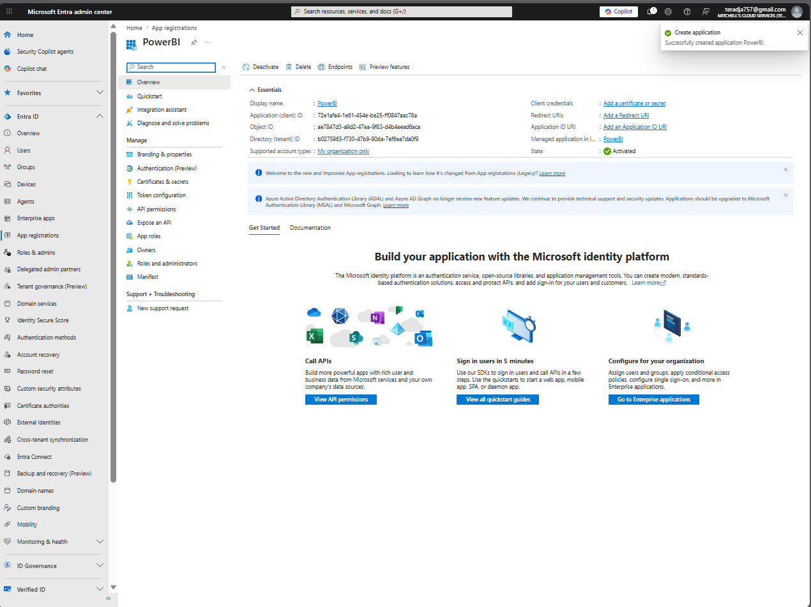
*Registration confirmed. Success toast reads "Successfully created application PowerBI" and the overview blade populates with the app's IDs.*

**Recorded IDs**

| Field | Value |
|-------|-------|
| Application (client) ID | `72e1afe4-1e61-454e-be25-ff0847aac78a` |
| Object ID | `ae7847d3-a9d2-47ea-9f83-d4b4eead6aca` |
| Directory (tenant) ID | `b0275963-f730-47b9-90da-7ef6ea7da0f9` |
| Service Principal ID | `a9048aab-11a8-47f1-b979-32f0a1750708` |

### Step 3 Configure API Permissions

Opened the API permissions blade. Every new registration starts with the same default: Microsoft Graph > User.Read (Delegated). That's the minimum needed for a user to sign in.

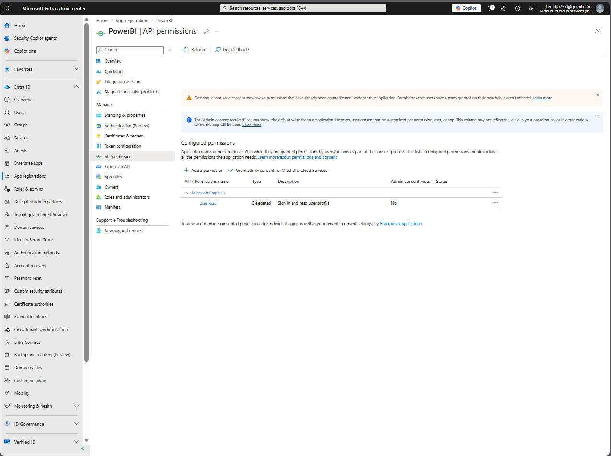
*Default permission state Microsoft Graph > User.Read only.*

Clicked + Add a permission, selected Power BI Service, chose Delegated permissions, and added the three scopes this application requires.

These scopes weren't chosen arbitrarily. In practice you don't guess what permissions to request you go to the official API reference for the service you're integrating and look up the endpoints your application actually needs to call. The [Microsoft Power BI REST API reference](https://learn.microsoft.com/en-us/rest/api/power-bi/) lists every endpoint alongside the exact permission scope required to call it. You find the operations your app needs, add only those scopes, and stop there. Requesting broader access than what the application actually calls isn't just sloppy it's a least-privilege violation and it will show up in a security review.

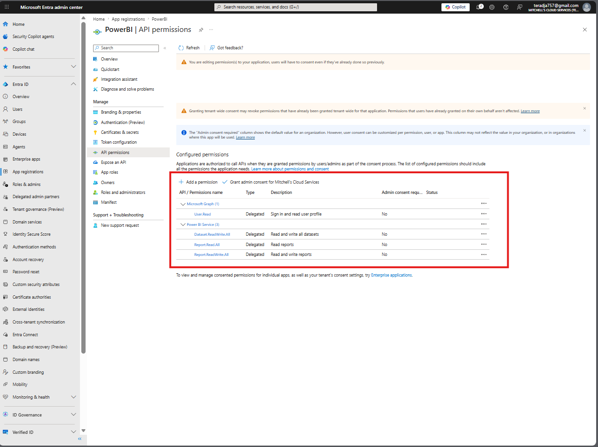
*Four permissions configured across Microsoft Graph (1) and Power BI Service (3).*

| API | Permission | Type | Description |
|-----|-----------|------|-------------|
| Microsoft Graph | `User.Read` | Delegated | Sign in and read user profile |
| Power BI Service | `Dataset.ReadWrite.All` | Delegated | Read and write all datasets |
| Power BI Service | `Report.Read.All` | Delegated | Read reports |
| Power BI Service | `Report.ReadWrite.All` | Delegated | Read and write reports |

### Step 4 Admin Consent

Clicked Grant admin consent for Mitchell's Cloud Services. The attempt failed.

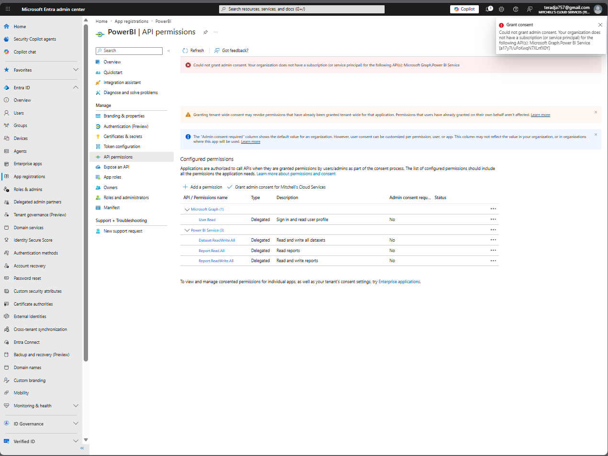
*Error: "Could not grant admin consent. Your organization does not have a subscription (or service principal) for the following API(s): Microsoft Graph, Power BI Service"*

This error is expected and worth documenting. The tenant has no Power BI subscription, which means the Power BI Service API has no service principal registered in this directory. Consent has to be granted against a service principal if one doesn't exist, there's nothing to consent against. The permissions configured are still saved on the app registration. The error only blocked the consent grant, not the permission setup.

In a licensed tenant with an active Power BI subscription this button does two things. First, it pre-approves all configured permissions on behalf of every user in the organization so nobody gets hit with a consent prompt when they sign in. Second, it flips the Status column for each permission from "No" to a green checkmark the confirmation that the permission is live and the app is authorized to call that API. This screenshot is more instructive than a green checkmark because it shows the reasoning behind what failed and what the production difference looks like.

### Step 5 Create App Roles

Clicked App roles in the left nav. App Roles are custom authorization claims published by the application. When a user is assigned a role and signs in, Entra ID includes that role's Value as a claim inside their access token. The application reads that claim and decides what the user is allowed to do this is RBAC at the app layer, on top of what Entra already handles at the directory level.

**PowerBI Admins**
- 3 members admin access should always be restricted to the people who actually need it

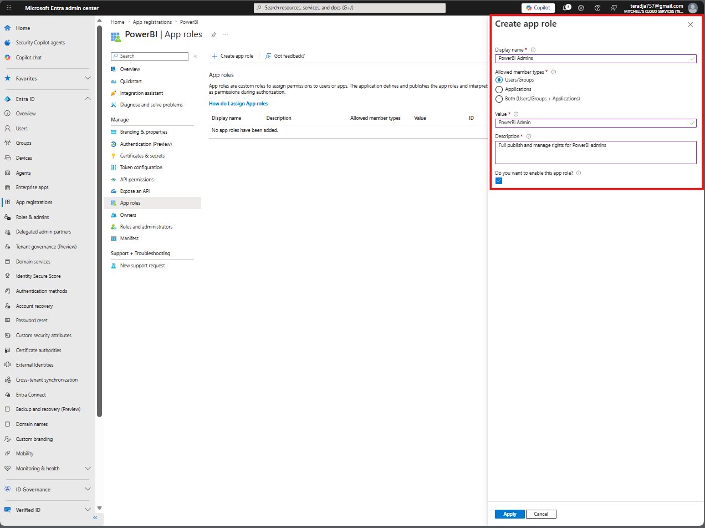
*Display name: PowerBI Admins, Allowed member types: Users/Groups, Value: PowerBI.Admin, Description: Full publish and manage rights for PowerBI admins, Enable: checked.*

Clicked Apply.

**PowerBI Users**
- 6 members broader access, view and interact with reports only

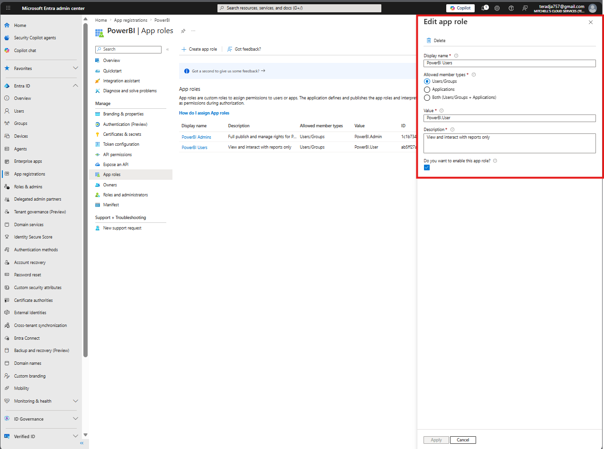
*Both roles live in the App roles list PowerBI Admins (PowerBI.Admin) and PowerBI Users (PowerBI.User).*

| Display Name | Token Claim Value | Allowed Members | Description |
|-------------|------------------|----------------|-------------|
| PowerBI Admins | `PowerBI.Admin` | Users/Groups | Full publish and manage rights |
| PowerBI Users | `PowerBI.User` | Users/Groups | View and interact with reports only |

### Step 6 Assign Users via Enterprise Application

Roles are defined on the App Registration. Assignments happen on the Enterprise Application the Service Principal side. Navigated to Enterprise apps > All applications > PowerBI > Users and groups.

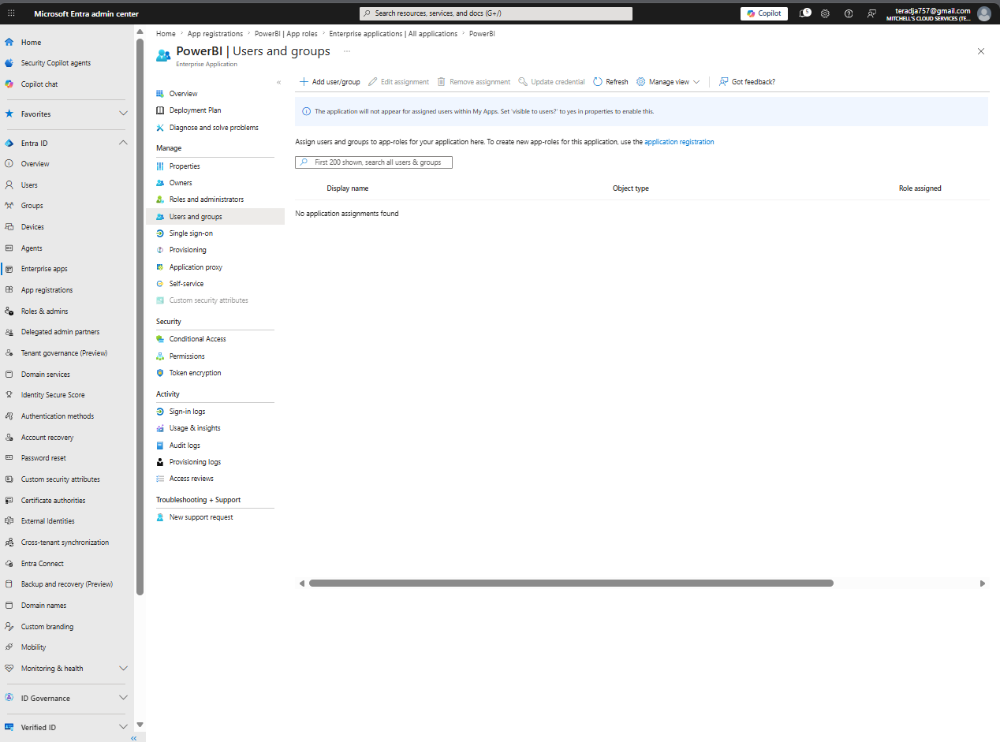
*Users and groups blade with no assignments yet.*

Clicked Add user/group and got a warning immediately.

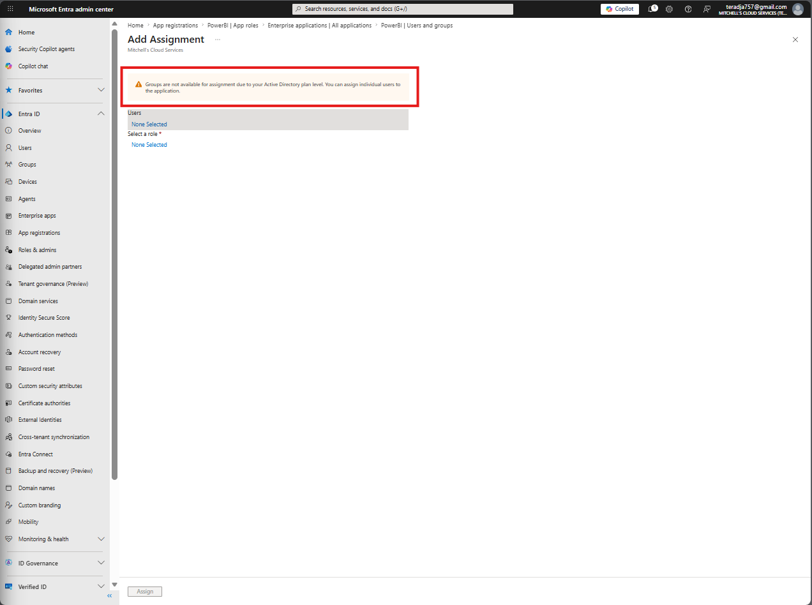
*Warning: "Groups are not available for assignment due to your Active Directory plan level. You can assign individual users to the application."*

This is the same free-tier limitation from Lab 02 and Lab 03. Group-based app role assignment requires Entra ID P1. On the free tier, assignments go to individual users only. The production pattern here is the same as those labs create SG-App-PowerBI-Admins and SG-App-PowerBI-Users, assign the groups to the roles, and manage access through group membership from that point forward. Individual user assignment works for a lab but it doesn't scale and creates an audit problem in any real environment.

**Admin role assignments**

Selected DeShawn Scott, Imani King, and Teradja Mitchell. Set role to PowerBI Admins.

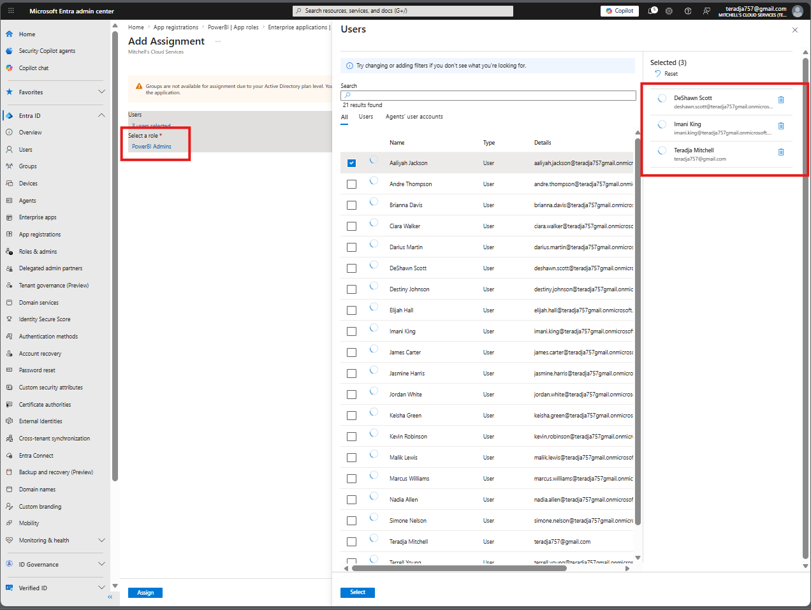
*Three users selected with PowerBI Admins role chosen. Group limitation banner visible at the top.*

Clicked Assign.

**User role assignments**

Selected Andre Thompson, Brianna Davis, James Carter, Marcus Williams, Nadia Allen, and Simone Nelson. Set role to PowerBI Users.

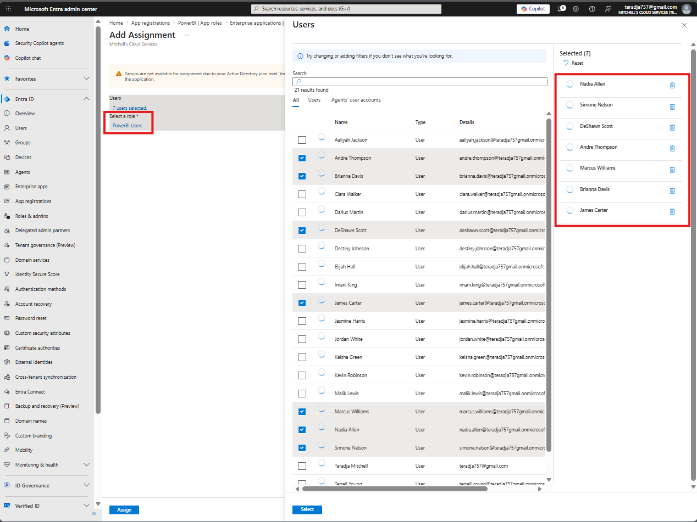
*Six users selected with PowerBI Users role chosen.*

Clicked Assign.

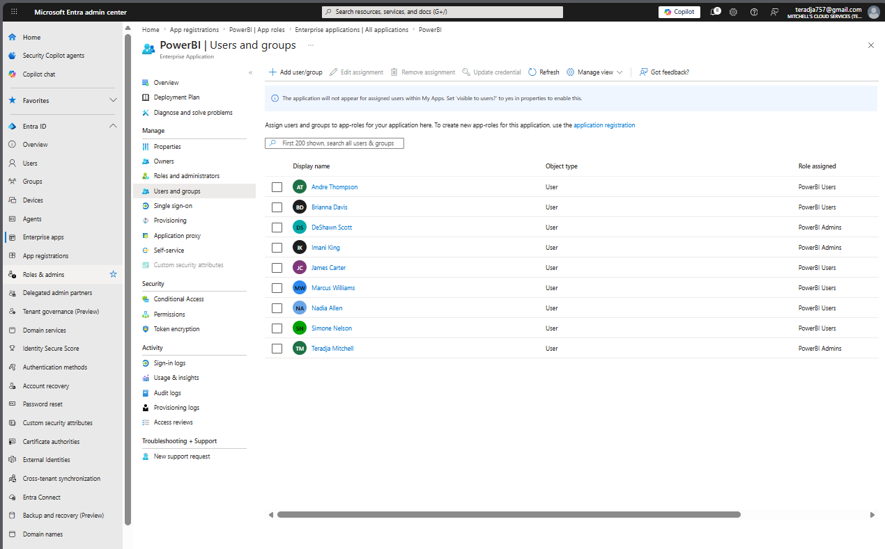
*All nine assignments confirmed in the Users and groups blade with correct roles.*

| User | Object Type | Role Assigned |
|------|------------|--------------|
| DeShawn Scott | User | PowerBI Admins |
| Imani King | User | PowerBI Admins |
| Teradja Mitchell | User | PowerBI Admins |
| Andre Thompson | User | PowerBI Users |
| Brianna Davis | User | PowerBI Users |
| James Carter | User | PowerBI Users |
| Marcus Williams | User | PowerBI Users |
| Nadia Allen | User | PowerBI Users |
| Simone Nelson | User | PowerBI Users |

## Part 2 PowerShell

Connected to Microsoft Graph with the scopes needed to read app registration and role assignment data:

```powershell
Connect-MgGraph -Scopes "Application.Read.All", "AppRoleAssignment.ReadWrite.All" `
    -TenantId "b0275963-f730-47b9-90da-7ef6ea7da0f9" -UseDeviceCode
```

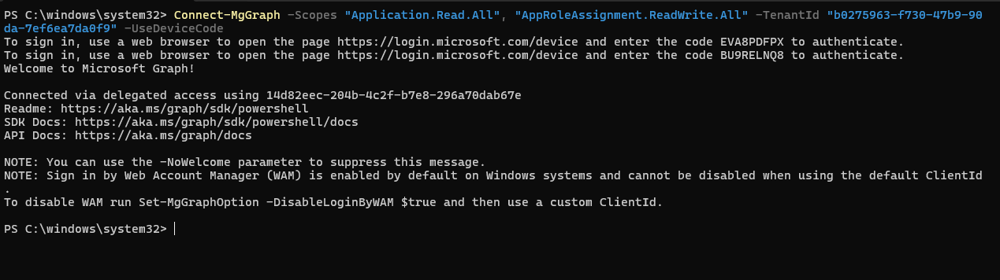
*Connected to Microsoft Graph via device code authentication. -UseDeviceCode is required because MFA is enforced on this tenant from Lab 01.*

### Export All App Role Assignments

Pulled the app and service principal objects, looped through every assignment, resolved each one to a readable user and role name, and exported to CSV. This is the type of report you produce during a SOC 2 access review when an auditor asks you to document who has access to what inside an application and under what authorization.

```powershell
$app = Get-MgApplication -Filter "DisplayName eq 'PowerBI'"
$sp  = Get-MgServicePrincipal -Filter "DisplayName eq 'PowerBI'"

$assignments = Get-MgServicePrincipalAppRoleAssignedTo -ServicePrincipalId $sp.Id
$report = @()

foreach ($assignment in $assignments) {
    $user = Get-MgUser -UserId $assignment.PrincipalId -ErrorAction SilentlyContinue
    $role = $app.AppRoles | Where-Object { $_.Id -eq $assignment.AppRoleId }

    $report += [PSCustomObject]@{
        UserName  = $user.DisplayName
        UserUPN   = $user.UserPrincipalName
        RoleName  = $role.DisplayName
        RoleValue = $role.Value
    }
}

$report | Format-Table -AutoSize
$report | Export-Csv -Path "C:\MCS_PowerBI_Assignments.csv" -NoTypeInformation
Write-Host "Report exported to C:\MCS_PowerBI_Assignments.csv"
```

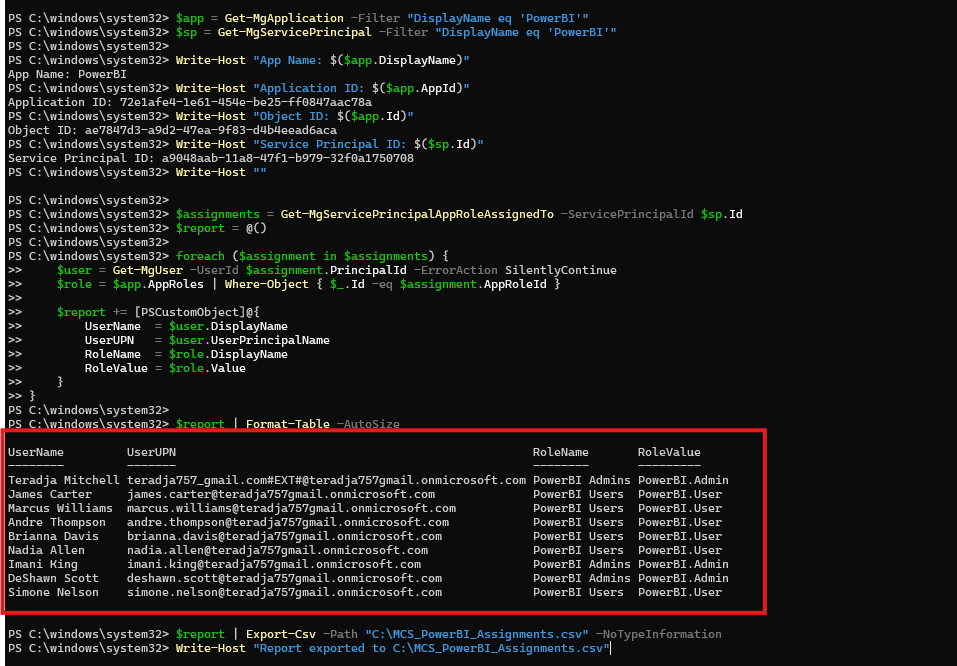
*All 9 assignments queried and displayed. Report exported to C:\MCS_PowerBI_Assignments.csv.*

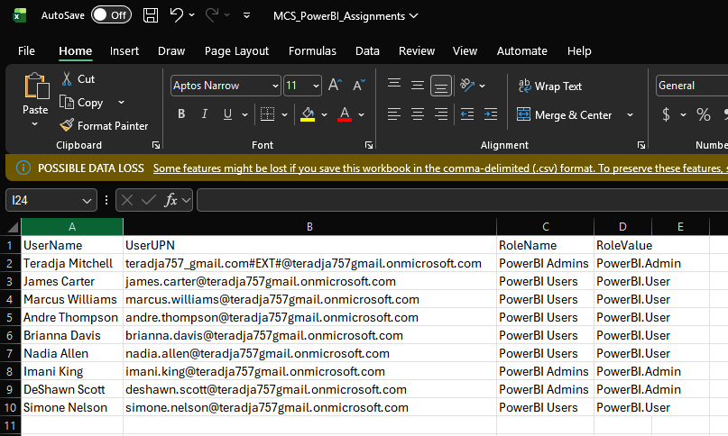
*Full assignment report open in Excel UserName, UserUPN, RoleName, and RoleValue for all nine principals.*

| UserName | UserUPN | RoleName | RoleValue |
|----------|---------|----------|-----------|
| Teradja Mitchell | `teradja757_gmail.com#EXT#@teradja757gmail.onmicrosoft.com` | PowerBI Admins | `PowerBI.Admin` |
| Imani King | `imani.king@teradja757gmail.onmicrosoft.com` | PowerBI Admins | `PowerBI.Admin` |
| DeShawn Scott | `deshawn.scott@teradja757gmail.onmicrosoft.com` | PowerBI Admins | `PowerBI.Admin` |
| James Carter | `james.carter@teradja757gmail.onmicrosoft.com` | PowerBI Users | `PowerBI.User` |
| Marcus Williams | `marcus.williams@teradja757gmail.onmicrosoft.com` | PowerBI Users | `PowerBI.User` |
| Andre Thompson | `andre.thompson@teradja757gmail.onmicrosoft.com` | PowerBI Users | `PowerBI.User` |
| Brianna Davis | `brianna.davis@teradja757gmail.onmicrosoft.com` | PowerBI Users | `PowerBI.User` |
| Nadia Allen | `nadia.allen@teradja757gmail.onmicrosoft.com` | PowerBI Users | `PowerBI.User` |
| Simone Nelson | `simone.nelson@teradja757gmail.onmicrosoft.com` | PowerBI Users | `PowerBI.User` |

## Compliance Mapping

| Framework | Control | How This Addresses It |
|-----------|---------|----------------------|
| HIPAA | 45 CFR 164.312(a)(1) | Role-based access control with defined privilege boundaries per application role |
| SOC 2 | CC6.1, CC6.3 | Logical access controls and least-privilege enforcement at the application layer |
| HITRUST CSF | 01.a, 01.b | Formal access control with defined roles and documented permission scopes |
| NIST 800-53 | AC-2, AC-3, AC-6 | Account management, access enforcement, and least privilege |

## What I Would Do Differently in Production

- Use Entra ID P1 to assign app roles to SG-App-PowerBI-Admins and SG-App-PowerBI-Users directly instead of individual users
- Grant admin consent in a licensed tenant to pre-approve all permissions org-wide so users never see a consent prompt
- Scope permissions to exactly what the application calls nothing beyond what the API docs require
- Run quarterly access reviews on all app role assignments
- Monitor the service principal's sign-in logs for anomalous API usage patterns

## References

- [Microsoft Docs App registrations vs Enterprise applications](https://learn.microsoft.com/en-us/entra/identity-platform/app-objects-and-service-principals)
- [Microsoft Docs App roles](https://learn.microsoft.com/en-us/entra/identity-platform/howto-add-app-roles-in-apps)
- [Microsoft Power BI REST API reference](https://learn.microsoft.com/en-us/rest/api/power-bi/)
- [Microsoft Graph API reference](https://learn.microsoft.com/en-us/graph/api/overview)
- [Microsoft Graph PowerShell Get-MgServicePrincipalAppRoleAssignedTo](https://learn.microsoft.com/en-us/powershell/module/microsoft.graph.applications/get-mgserviceprincipalapproleassignedto)

*Teradja Mitchell | [LinkedIn](https://www.linkedin.com/in/teradja-mitchell-0494b9208) | [GitHub](https://github.com/teradja757)*
