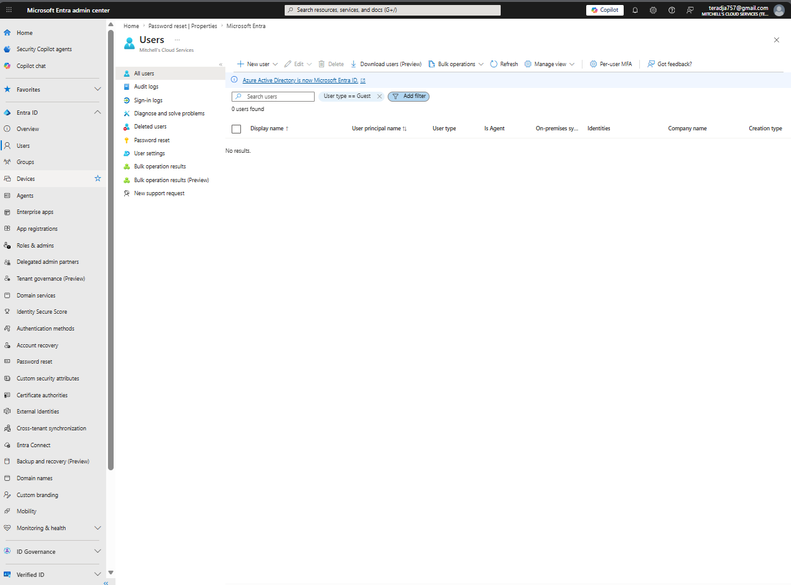
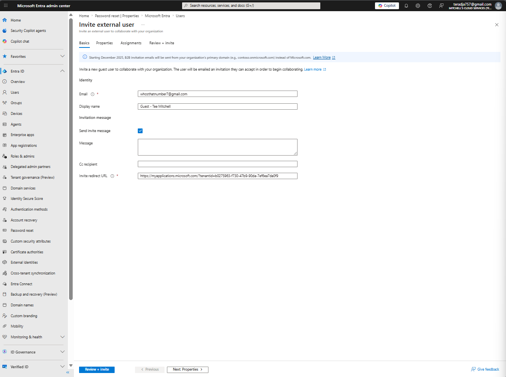
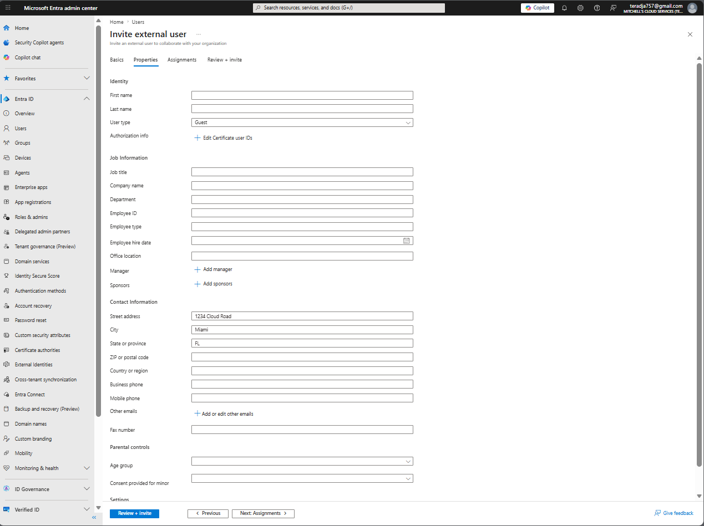
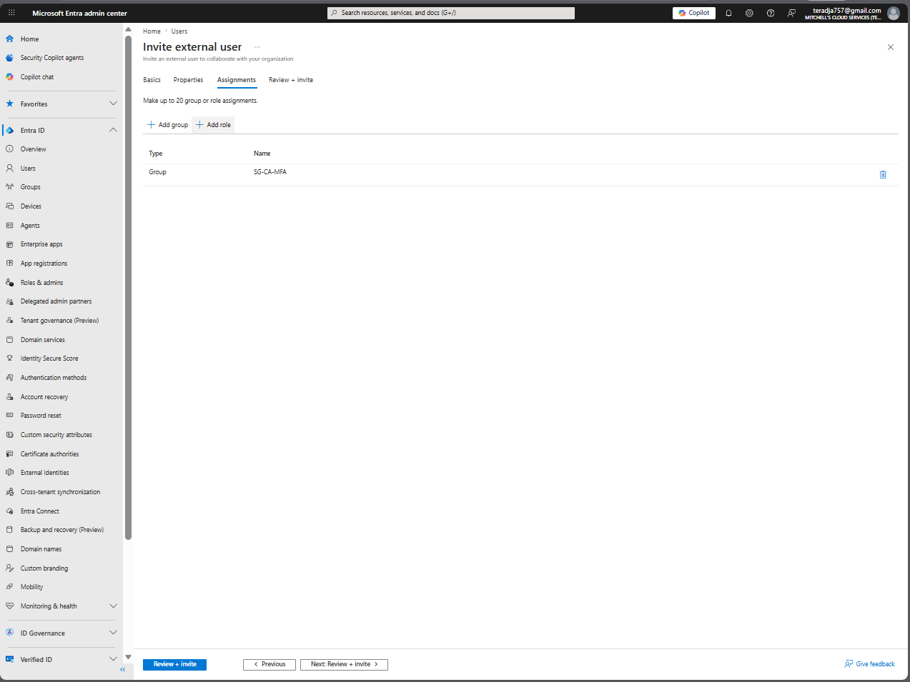
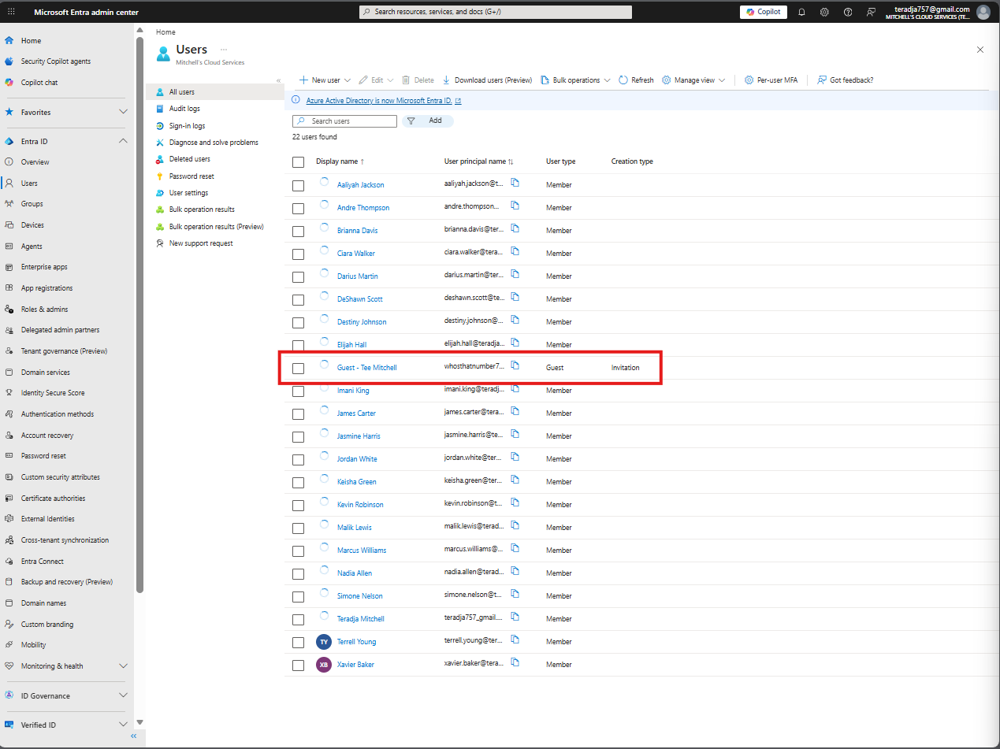
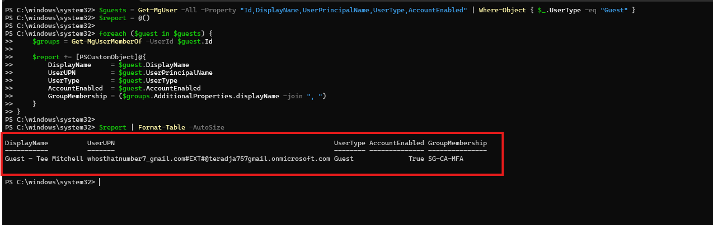

# Lab 05 - Guest User Access and B2B Collaboration

**Platform:** Microsoft Entra ID
**Tenant:** Mitchell's Cloud Services
**License:** Microsoft Entra ID Free

## What This Lab Covers

Invited an external guest user into the tenant using Entra ID B2B collaboration, configured their profile properties, assigned them to a security group, and validated the guest account via PowerShell. The lab also covers how guest access works by default in Entra ID, what permissions guests have versus members, and how you would structure guest access properly in a production environment.

## Why Guest Access Management Matters

Organizations don't operate in isolation. Vendors, contractors, auditors, and partners all need some level of access to internal resources. B2B collaboration lets you extend controlled access to external users without creating full member accounts in your directory. The guest account lives in your tenant but their identity is managed by their home organization or personal account - you control what they can access, they manage their own credentials.

The risk with guest access is sprawl. Guests get invited, the project ends, and nobody cleans them up. Left unmanaged, stale guest accounts become an attack surface. This lab covers the invite and validation side. The production section covers how you keep it clean over time.

## Environment

- **Tenant:** Mitchell's Cloud Services
- **Admin account:** Teradja Mitchell
- **Starting state:** 21 member accounts, 0 guest users

## Guest Invited

| Field | Value |
|-------|-------|
| Display name | Guest - Tee Mitchell |
| Email | whosthatnumber7@gmail.com |
| User type | Guest |
| Creation type | Invitation |
| Group assigned | SG-CA-MFA |
| Assigned roles | None |

## Part 1 - Portal

### Step 1 - Confirm Baseline

Navigated to Entra ID > Users and filtered by User type == Guest to confirm no guest accounts existed before starting.


*Users blade filtered to Guest - 0 users found. Clean starting state.*

### Step 2 - Invite External User

Clicked New user and selected Invite external user from the dropdown. The B2B invite flow has four tabs - Basics, Properties, Assignments, and Review + invite. Worth walking through each one rather than skipping straight to send.


*Basics tab - Email set to whosthatnumber7@gmail.com, Display name set to Guest - Tee Mitchell, Send invite message enabled, Invite redirect URL auto-populated with the tenant's My Applications URL.*

### Step 3 - Configure Properties

The Properties tab is where you fill in job information and contact details for the guest. For external users this gives you a record of who they are and where they're coming from without relying on their home directory to surface that information.

Left most fields blank for this lab since this is a personal account being used for demonstration. In production you would fill in company name, job title, department, and a sponsor so there's always an internal owner accountable for the guest's access.


*Properties tab - User type set to Guest, contact info partially filled. Job information left blank for this lab.*

### Step 4 - Assign to Group

The Assignments tab controls which groups and roles the guest gets at the point of invitation. Guests should not be assigned Entra ID directory roles. Their access should be scoped to specific resources through group membership only.

Assigned the guest to SG-CA-MFA. This is the right call - if you're letting an external user into your environment, requiring MFA on their account is the minimum security baseline. SG-CA-MFA was built in Lab 02 specifically as the tenant-wide MFA target group. Adding a guest to it means they fall under the same MFA requirement as every internal member.


*Assignments tab - Group set to SG-CA-MFA. Roles left empty intentionally.*

### Step 5 - Review and Send

Clicked Review + invite to confirm everything before sending. The summary shows all four sections - Basics, Properties, Assignments, and the invite redirect URL.


*Review summary - Email, display name, user type, contact info, group assignment, and roles all confirmed before sending.*

Clicked Invite.

### Step 6 - Confirm Guest in Tenant

Navigated back to the Users blade. The tenant now shows 22 users. Guest - Tee Mitchell appears in the list with User type = Guest and Creation type = Invitation.


*22 users total. Guest - Tee Mitchell visible with User type Guest and Creation type Invitation.*

### Step 7 - Review Guest Profile

Opened the guest user profile to review the account details. A few things worth noting on this screen. The UPN for a B2B guest follows the format `externalemail#EXT#@yourtenant.onmicrosoft.com` - this is how Entra ID represents an external identity inside your directory. The B2B invitation shows Pending acceptance because the guest has not clicked the link in their invite email yet. Account status is Enabled, assigned roles are 0, and group memberships show 1.


*Guest profile overview - UPN, user type, object ID, created date, group memberships (1), assigned roles (0), B2B invitation pending acceptance, account enabled.*

## Part 2 - PowerShell

Connected to Microsoft Graph with the scope needed to read user data:

```powershell
Connect-MgGraph -Scopes "User.Read.All" `
    -TenantId "b0275963-f730-47b9-90da-7ef6ea7da0f9" -UseDeviceCode
```

### Validate Guest Users and Group Memberships

Pulled all guest accounts in the tenant, resolved their group memberships, and displayed the full report. One thing to note - UserType is not returned by default in the Graph SDK. You have to explicitly request it in the -Property flag or the Where-Object filter returns nothing.

```powershell
$guests = Get-MgUser -All -Property "Id,DisplayName,UserPrincipalName,UserType,AccountEnabled" `
    | Where-Object { $_.UserType -eq "Guest" }

$report = @()

foreach ($guest in $guests) {
    $groups = Get-MgUserMemberOf -UserId $guest.Id

    $report += [PSCustomObject]@{
        DisplayName     = $guest.DisplayName
        UserUPN         = $guest.UserPrincipalName
        UserType        = $guest.UserType
        AccountEnabled  = $guest.AccountEnabled
        GroupMembership = ($groups.AdditionalProperties.displayName -join ", ")
    }
}

$report | Format-Table -AutoSize
```


*Guest - Tee Mitchell returned with UserType Guest, AccountEnabled True, and GroupMembership SG-CA-MFA confirmed.*

## Compliance Mapping

| Framework | Control | How This Addresses It |
|-----------|---------|----------------------|
| HIPAA | 45 CFR 164.312(a)(1) | External user access controlled through group-based permissions with no standing directory roles |
| SOC 2 | CC6.2, CC6.3 | Third-party access managed through formal invitation process with documented group assignment |
| HITRUST CSF | 01.a, 07.a | Access control for external identities with defined scope and account accountability |
| NIST 800-53 | AC-2, AC-17 | Account management for external users and controlled remote access |

## What I Would Do Differently in Production

- Create a dedicated group like SG-Guests-External to scope guest access separately from internal member groups
- Set a defined expiration on every guest account at the point of invitation so stale accounts get flagged automatically
- Enable access reviews on the guest group on a quarterly cycle so an internal owner is reviewing and re-approving every guest account regularly
- Require a named internal sponsor for every guest invite so there is always someone accountable for that access
- Use External Identities settings to restrict which domains can be invited - block personal email domains and limit invites to known partner domains
- Run the PowerShell guest audit on a schedule and review any account still showing Pending acceptance after 30 days

## References

- [Microsoft Docs - B2B collaboration overview](https://learn.microsoft.com/en-us/entra/external-id/what-is-b2b)
- [Microsoft Docs - Invite guest users to your directory](https://learn.microsoft.com/en-us/entra/external-id/add-users-administrator)
- [Microsoft Docs - Guest user default permissions](https://learn.microsoft.com/en-us/entra/fundamentals/users-default-permissions)
- [Microsoft Docs - Manage guest access with access reviews](https://learn.microsoft.com/en-us/entra/id-governance/manage-guest-access-with-access-reviews)
- [Microsoft Graph PowerShell - Get-MgUser](https://learn.microsoft.com/en-us/powershell/module/microsoft.graph.users/get-mguser)

*Teradja Mitchell | [LinkedIn](https://www.linkedin.com/in/teradja-mitchell-0494b9208) | [GitHub](https://github.com/teradja757)*
